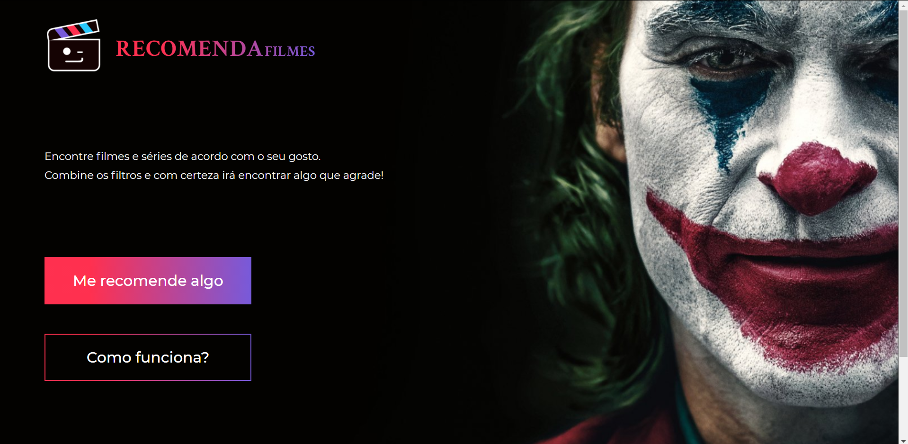
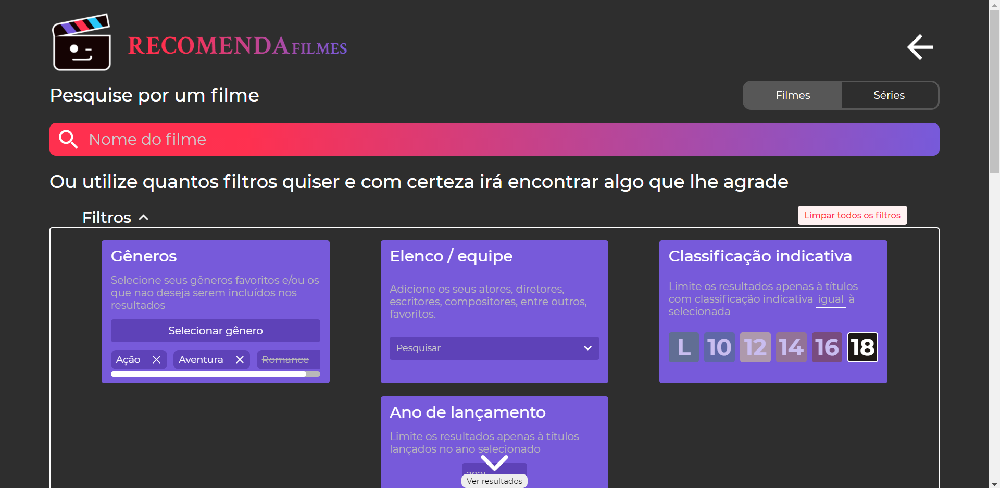
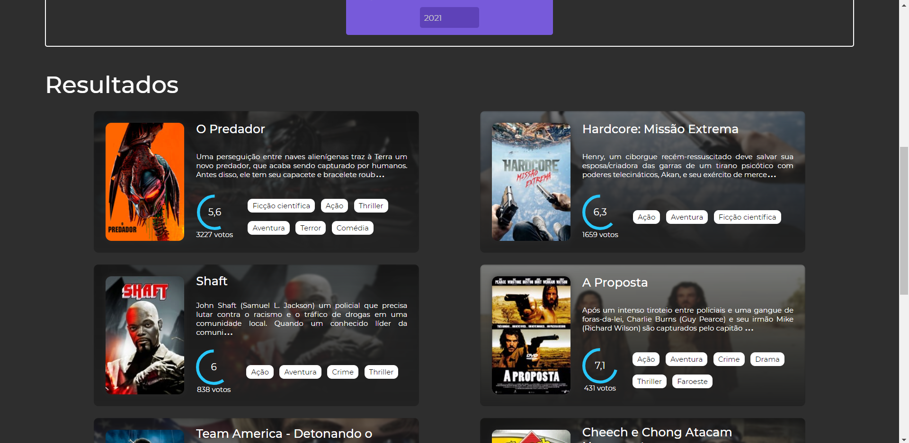
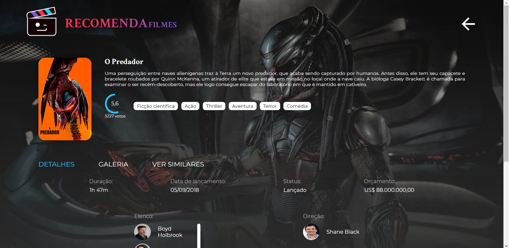

<h1>RecomendaFilmes</h1>

RecomendaFilmes é uma plataforma criada com React, que recomenda filmes e séries, onde você pode combinar múltiplos filtros para achar algo que lhe agrade

 

🤳 Screenshots

  

    
    
    
    
  

</h3>

 

## 📜 Sobre
[Vídeo de demonstração](https://www.youtube.com/watch?v=DhE6_Zahem8)

Esse projeto foi criado usando Create-React-App e o deploy com Vercel, a API utilizada para pegar todas as informações dos filmes e shows de TV pode ser acessada aqui:
[TMDB](https://www.themoviedb.org/documentation/api).   Eu também criei o design que pode ser acessado aqui:
[Figma](https://www.figma.com/file/suKkINUZunA8LzMGjXXBwr/RecomendaFilmes?node-id=1%3A5i).
 
