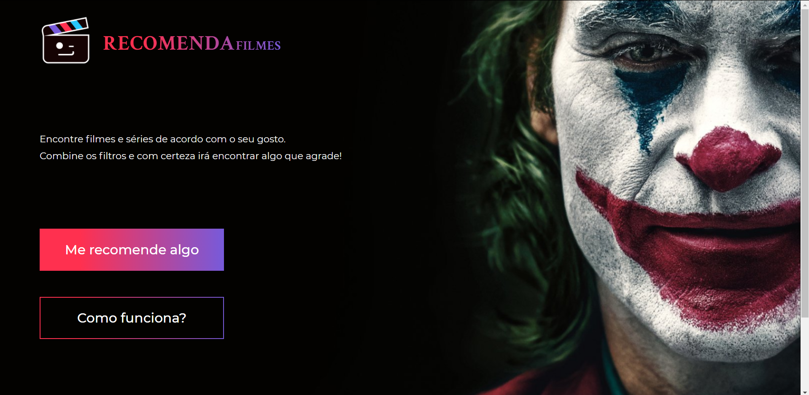
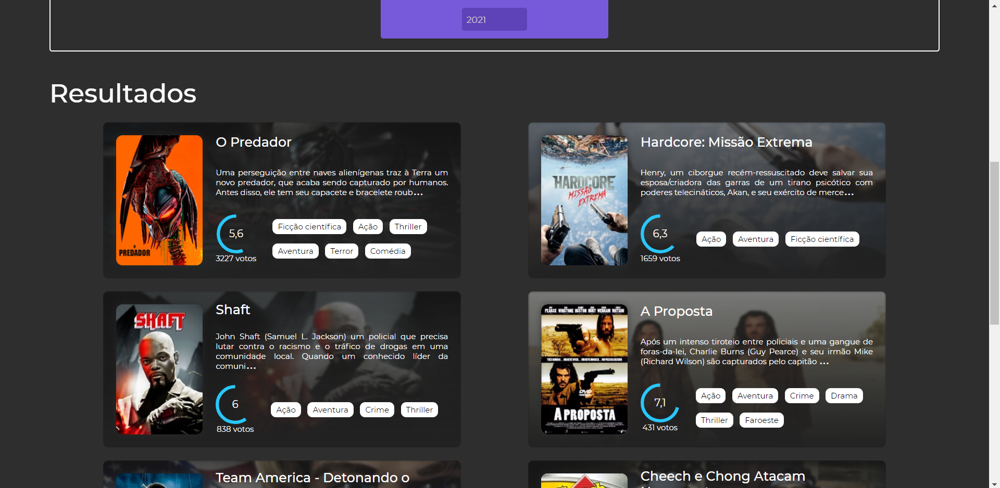
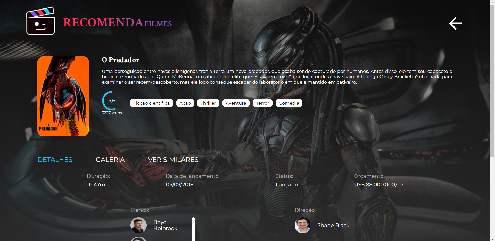

<h1>RecomendaFilmes</h1>

RecomendaFilmes is a platform created in React, that recommends movies and series, you can combine multiple filters to find something you'll like

    <a href="README-pt.md">README em Português</a>
 

<h3>

 

🤳 Screenshots

  

    
    
    
    
  

</h3>

 

## 📜 About
[Showcase video](https://www.youtube.com/watch?v=DhE6_Zahem8)

This project is created using Create-React-App and is deployed with Vercel, the API used to get all the movies and TV shows information is free, and can be accessed here:
[TMDB](https://www.themoviedb.org/documentation/api).   I've also created the design which can be accessed here: 
[Figma](https://www.figma.com/file/suKkINUZunA8LzMGjXXBwr/RecomendaFilmes?node-id=1%3A5i).
 
